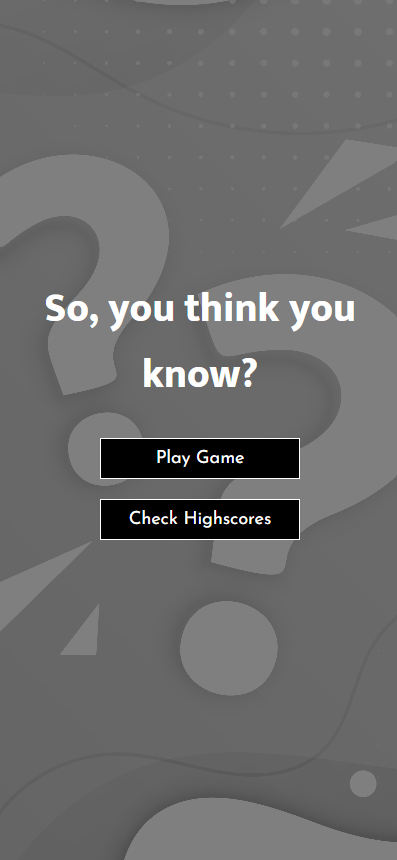
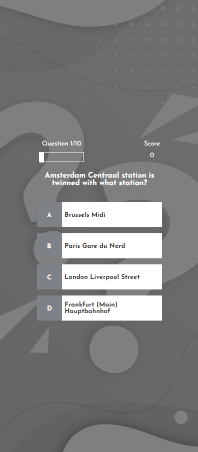
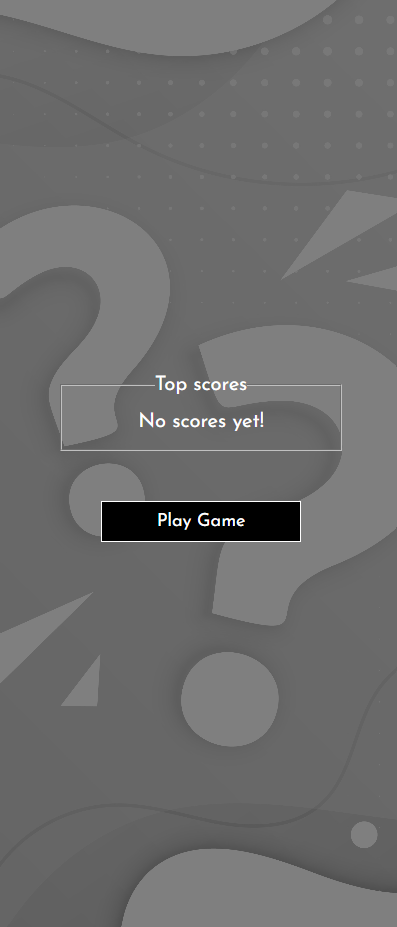
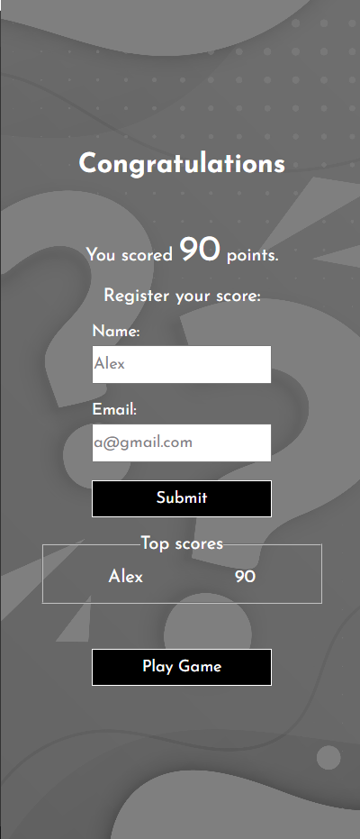
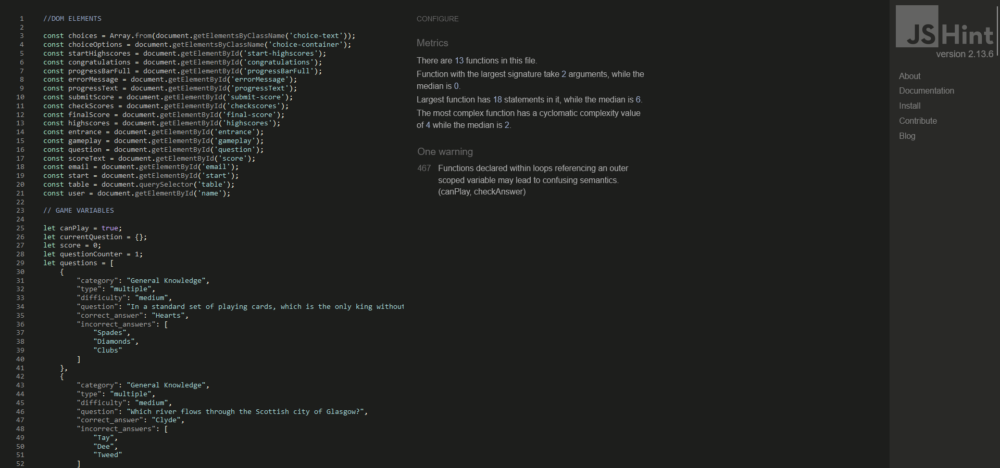

# **So, you think you know?**
## **Site Overview**
The 'So, You Think You Know?' website was created to provide a fun entertaiment for whoever would like to test if they have the knowledge on the questions being put on the website. The objective is to offer four differents options of answers so that the user can choose the correct one. By the end, they can upload their score to the Top Scores table. If they are one of the top five, their score will be shown. 

​
## Table of contents:
1. [**Site Overview**](#site-overview)
1. [**Planning stage**](#planning-stage)
    * [***Target Audiences***](#target-audiences)
    * [***User Stories***](#user-stories)
    * [***Site Aims***](#site-aims)
    * [***Color Scheme***](#color-scheme)
    * [***Typography***](#typography)
1. [**Current Features**](#current-features)
    * [***Game Entrance***](#game-entrance)
    * [***Game***](#game)   
    * [***Congratulations and Topscores***](#congratulations-and-topscores)
1. [**Future-Enhancements**](#future-enhancements)
1. [**Testing Phase**](#testing-phase)
1. [**Deployment**](#deployment)
1. [**Tech**](#tech)
1. [**Credits**](#credits)
    * [**Honorable mentions**](#honorable-mentions)
    * [**General reference**](#general-reference)
    * [**Content**](#content)
    * [**Media**](#media)
​
## **Planning stage**
### **Target Audiences:**
* Users interested in quiz games.
* Users interested in general knowledge.
* Users interested in trying to score higher than their friends.
​
### **User Stories:**
* As a user, I want to have fun.
* As a user, I want the website to be fast and provide me with questions quickly.
* As a user, I want to know if my answer was the correct one or not.
* As a user, I want to know how good I am in comparison to other players.
​
### **Site Aims:**
* To provide a fun interactive game.
* To create a challenge for the user and the players.
* Light and easily accessed by anyone anywhere.
​
### **Color Scheme:**
​
The colors chosen were white(#fff), black(#000) and variations of grey(#7E8287). It gives the website a sobriety and style and also do not distract the user from the questions and the available. The only two other colors that vary from that are the colors green (#4F9D69) and red (#ff5400), to show to the user if they have chosen the correct or wrong answers, respectively.
​
## **Typography**
​
* Throughout the page, there are two fonts used:
  * Josefin Sans - For the logo. It gives a slim image without distancing the website from the user.
  * Mukta - For all the other text in the website.
​
* Both fonts were used to complement eachother. They provide clean visuals regardless of the screensize.
* All fonts were sourced from Google fonts, as stated in the credits.
​
## **Current Features**
​
#### *Entrance:*

* This part of the page is divided in two parts: the name/logo of the page and the buttons, to access either the game itself or the topscores table.
* There is only one change when accessed on bigsreens, where the buttons change the column direction to a row one.

#### *Game:*

* The game is divided in three different parts: the hud, where it shows how many questions have been answered until that point and the amount of points; the question; and the four different available answers.
* When a user chooses one of the answers, the background changes to inform the user if they got it right or wrong, with a green or red color, respectively.

#### *Congratulations and Topscores:*

* This page can be accessed on the entrance of the game or after the user answers ten questions. If it is accessed without playing the game, the page only shows to the user the topscores and the "Play Game" button. If they finish the game, they are greeted with a congratulations message, their score and the possibility of registering the score.
* The registration requires a name and email. The same user is allowed to play more than once and register their score.

​
## **Future-Enhancements**
​
* The website uses a small base of questions to randomly present to the user. After futher study of Javascript, the funcionality of fetch can be added to the code to collect from a source a bigger availability of questions.
​
## **Testing Phase**
​
* Responsiveness - To ensure that the responsiveness of the website was the best possible, to project was built having the mobile access as the base of the design. The initial tests were made on the mobile, extensively and in different models, to confirm that the website was delivering what it was proposed.

    On mobile, the website was tested on the following devices:
    * Samsung 20FE
    * Iphone 13 Pro Max

    No issues were noted upon project completion.

    On tablets, the website was tested on the following device:
    * Ipad Air 4

    No issues were noted upon project completion.

    On notebooks, the website was tested on the following devices:
    * Dell Latitute 15
    * Macbook Air

    No issues were noted upon project completion.

    For the desktop tests, an Asus VX228 monitor was also used.
    No issues were noted upon project completion.
​
* Functionality - 
    * All the links on the navigation bar redirect to the correct sections of the page in a smooth transition.
    * Each image of the services section, when hovered on big screens, have an hoover effect.
    * In the form section, the name, email (inputs) and textarea are required if the user decides to send a message.
​
* Validators

. HTML [W3C HTML Validator](https://validator.w3.org/)

. CSS - [Jigsaw CSS Validator](https://jigsaw.w3.org/css-validator/)
​

. Javascript - [JSHint Validator](https://jshint.com/)
​

. Google Lighthouse
​
​
## **Bugs**

Problem 🐞: Text on the hero-image unreadable on big screens.

Cause🛠: The location of the text on big screens was on the white area of the image.

Resolution✅: Another div was added in-between to provide shading when on big screens.
*** 
Problem 🐞: Page taking too long to load and impacting the performance.

Cause🛠: The original image files were too large.

Resolution✅: Images were compressed and the size reduced.​
***
Problem 🐞: Services headings unreadable.

Cause🛠: The background images are composed from different elements and colors.

Resolution✅: An span was added on the headings to provide a background color.
***
Problem 🐞: Low score on Google Lighthouse.

Cause🛠: Headers on the about us and services sections unreadable.

Resolution✅: Colors of the texts were slightly changed.
***

## **Deployment**
I deployed the page on GitHub pages via the following procedure: -
​
1. From the project's [repository](https://github.com/AlexDralur/quiz-project-2), go to the **Settings** tab.
2. From the left-hand menu, select the **Pages** tab.
3. Under the **Source** section, select the **Main** branch from the drop-down menu and click **Save**.
4. A message will be displayed to indicate a successful deployment to GitHub pages and provide the live link.
​
You  can find the live site via the following URL - [live webpage](https://alexdralur.github.io/quiz-project-2/)
***
​
## **Tech**
- HTML
- CSS
- Javascript
​
## **Credits**
### **Honorable mentions**
* Larissa Moura (my wife) - She was my tester and also my design guru.
* Richard Wells (my Code Institute tutor) - Help me throughout the project in all aspects.
​
### **Content:**
​
. Social media icons from footer took from FontAwesome.

. Social media HTML structure took from the Love Running project from Code Institute.
  
### **Media:**
​
Background image: <a href="https://www.freepik.com/free-vector/mystery-confusion-question-mark-background-liquid-style_38091790.htm#page=3&query=quiz%20pattern&position=15&from_view=search&track=ais">Image by starline</a> on Freepik
 